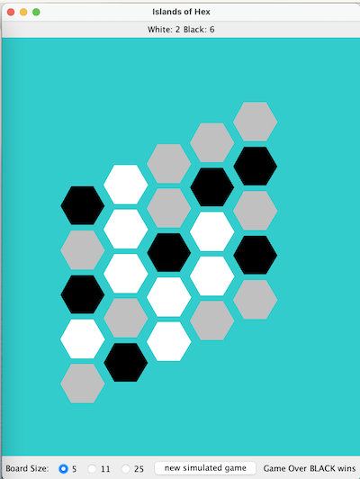

This is a game played on a grid style board - the grid is composed of hexagon shaped tiles. The game is a two player game with one player playing white game pieces and the other playing black game pieces. The goal for the game is to have the most islands on the game board when the game finishes. The game ends when either black bisects the board with a continuous chain of game pieces from left to right or white bisects the board with a continuous chain of game pieces from top to bottom.

An island is a connected group of similarly colored game pieces that are surrounded by either empty tiles or tiles occupied by the opposite color. Connections are determined by hexagons that share a border.

In the below example there are 2 white islands and 6 black islands (the gray squares are empty). In this case the white tiles have formed a path from the top of the board to the bottom and therefore the game is over. Since the game is over the black player has won the game 6-2 (note that ties are possible in this version of the game).

The game will have the following functionality:

- determining if a play into a specific row and column is valid
- playing a piece into a specific row, column
- determining the score for white and black
- determining if the game is over

There are 3 different built in game play scenarios:

- 5 x 5 quick play board
- 11 x 11 traditional play board
- 25 x 25 big game board

The game may be played with two players, or a game may be simulated with (non-intelligent) random computer players against each other.

There is an extensive set of unit-tests to ensure your solution is both accurate and efficient.
